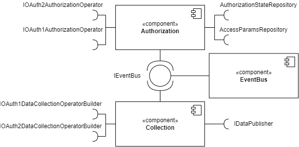

# Gardener Core

Gardener core is the general-purpose framework that enables
user authorization and data collection on wearable web services and
transforms the data into a customisable format.

## Architecture

The following diagram displays the three main components of the framework
and the required interfaces that are ought to be provided when
using the software.



- __Authorization component__: This component is responsible for user
authorization and for the initiation of the data collection process.


- __Collection component__: This component handles the data collection
and transformation


- __EventBus component__: The Event Bus handles the publisher/subscriber
based communication between the two main components.

## Implementation

### Required interfaces

The component diagram shows the interfaces required to be provided
upon implementation. 

The `repository` interfaces require persistence
of domain models. 

The `operator` interfaces need network communications
including OAuth authorization calls and data collection. 

The `IEventBus` interface can also be provided or the default 
[SingleThreadedEventBus](../gardener.core/src/main/kotlin/com/example/authenticationmodule/core/infrastructure/eventbus/SingleThreadedEventBus.kt)
can be used if parallelism is not needed.

Lastly, the `IDataPublisher` interface does not require anything specific,
it is up for the user what to do with the transformed data.
The `infrastructure` package contains in-memory-based storage classes
for the repositories for testing purposes.

### Data transformation

There is a `DataTypeTransformer` interface for every supported
web service that declares dedicated functions for every supported
data type. An implementation can be provided for these interfaces
and the custom classes can be registered using the `DataTypeTransformerRegistry`.

The following code snippet explains how custom transformers can be
registered for each supported web service:
```kotlin
transformerRegistry = DataTypeTransformerRegistryHost().apply {
    registerTransformer(FitbitDataSource.DATA_SOURCE_ID, FitbitCarpTransformerI())
    registerTransformer(GarminDataSource.DATA_SOURCE_ID, GarminCarpTransformerI())
    registerTransformer(WithingsDataSource.DATA_SOURCE_ID, WithingsCarpTransformerI())
    registerTransformer(DexcomDataSource.DATA_SOURCE_ID, DexcomEmptyTransformerI())
}
```

If custom transformers are not required, default empty transformers
are provided in the `infrastructure` package. These transformers return
the plain unmodified data collected directly from the web services.

### Module instantiations

After the required interfaces are implemented and custom
or default transformers are registered, the framework components
need to be instantiated.

The _Authentication Module_ requires the following classes to be
instantiated:
```kotlin
eventBus = SingleThreadedEventBus()
authorizationStateRepository = InMemoryAuthorizationStateRepository()
authorizationStateService = AuthorizationStateServiceHost(authorizationStateRepository)
accessParamsRepository = InMemoryAccessParamsRepository()
accessParamService = AccessParamsServiceHost(accessParamsRepository)
dataSourceRegistry = DataSourceRegistryHost(eventBus)
```

The _Collection Module_ instantiation looks like the following:
```kotlin
transformerRegistry = DataTypeTransformerRegistryHost().apply {
    registerTransformer(FitbitDataSource.DATA_SOURCE_ID, FitbitEmptyTransformerI())
    registerTransformer(GarminDataSource.DATA_SOURCE_ID, GarminEmptyTransformerI())
    registerTransformer(WithingsDataSource.DATA_SOURCE_ID, WithingsEmptyTransformerI())
    registerTransformer(DexcomDataSource.DATA_SOURCE_ID, DexcomEmptyTransformerI())
}
publisher = InMemoryDataPublisher()
oauth2DataCollectionService = OAuth2DataCollectionService(
    eventBus, publisher, transformerRegistry, OAuth2DataCollectionOperatorBuilder(vertx, properties))
oauth1DataCollectionService = OAuth1DataCollectionService(
    eventBus, publisher, transformerRegistry, OAuth1DataCollectionOperatorBuilder())
```

The `InMemory` classes can be substituted with custom implementations.
After the classes are ready, the chosen wearable web services need to
be registered. Using the `IDataSourceRegistry`, the registration is
displayed on the next code fragment using Fitbit as example:
```kotlin
val fitbitClientSettings = OAuth2ClientSettings(
    clientId = "xxx",
    clientSecret = "yyy",
    authorizationUri = "https://www.fitbit.com/oauth2/authorize",
    accessUri = "https://api.fitbit.com/oauth2/token",
    dataUrl = "https://api.fitbit.com",
    callbackUri = "zzz",
)
val fitbitDataSource = FitbitDataSource(
    eventBus,
    authorizationStateService,
    accessParamService,
    fitbitClientSettings,
    OAuth2Operator(fitbitClientSettings, vertx, properties)
)
dataSourceRegistry.activateDataSource(fitbitDataSource)
```
The concrete data sources require valid OAuth2 or OAuth1 credentials
to work, based on the protocol used by the web service. These can be
acquired on the developer portal of the desired web service.

The Authorization and Collection modules are modular and loosely coupled
due to the Event Bus, therefore they could be implemented separately
or together, it is up to the developer.

## Usage

In the majority of the time the interaction with the framework
happens with the Event Bus. To initiate data collection or signal
a successful authorization callback, the right `Event` has to be
published on the `EventBus` and the framework will handle the rest.

For instance, when OAuth1 credentials are received, the following
event has to be published.

```kotlin
eventBus.publish(this::class, OAuth1Event.AuthorizedTokenAcquired(
    stateId = stateId,
    requestToken = token,
    tokenVerifier = tokenVerifier,
    dataSourceId = dataSourceId,
    params = dataSource.getEstablishedAuthorizationRequestParams() as OAuth1AuthorizationRequestParams
))
```

The user is free to register arbitrary event handlers as well next to
the default ones.

## Building the project

The project utilises [Gradle](https://gradle.org/) as build tool, thus
the usual gradle command can be used to build the project.

The `test` package contains unit and integration tests that will be run
upon building the project. The test cases also act as examples of how
to set up the project and handle user authorization/data collection/
transformation.


