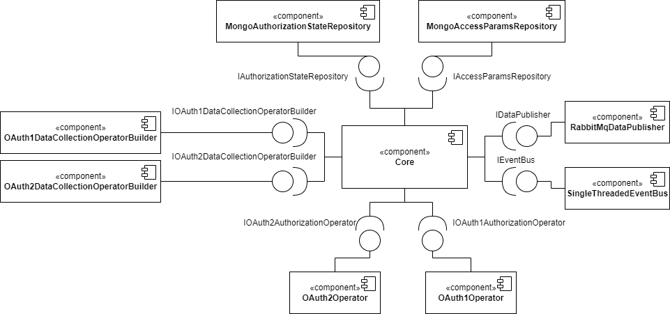
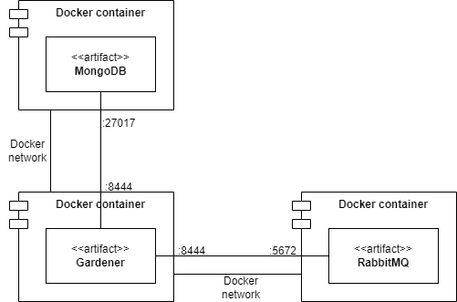

# Gardener CARP Implementation

This package contains an implementation of the Gardener Core customised
to meet [CACHET]("https://www.cachet.dk/") 's requirements. 

## Architecture

The component diagram of the project shows how the required interfaces
of the project are provided:



The _repositories_ are implemented using [MongoDB](https://www.mongodb.com/).

The _operators_ are implemented using the [Scribe Java](https://github.com/scribejava/scribejava)
library, which handles the necessary OAuth protocols requirements.

The _EventBus_ uses the [SingleThreadedEventBus](../gardener-core/src/main/kotlin/dk/carp/gardener/authentication/core/infrastructure/eventbus/SingleThreadedEventBus.kt).

The `IDataPublisher` interface is implemented using
[RabbitMQ](https://www.rabbitmq.com/). The data collected from the 
third-party services is transformed into the CARP _data point_ format
and published to the configured RabbitMQ queue.

As every required dependency is resolved the application is functional.
It is designed to run as its own microservice using 
[Vert.x](https://vertx.io/) and fully containerized using
[Docker](https://www.docker.com/). MongoDB and RabbitMQ instances are also
deployed in Docker containers and the application is configured to connect
to them over a Docker network. The following deployment diagram displays
how the containers are connected.



## Running the application

There are currently three profiles in the application:
`local`, `test` and `prod`. The respective configuration files are 
located in the resources folder. They declare connection string and secrets
for each environment. The `test` profile is used to run the tests,
`local` profile is for local development and the `prod` is for server 
deployment. To set the desired profile, set the environment variable 
`profile` to the desired value.

The _docker_ folder contains two Docker Compose files for the
`local` and `prod` environments. The local compose file fires up a
MongoDB and a RabbitMQ instance for local development. The prod compose
file fires up additionally the application and connects it to the network.

## Deployment

Issue the following command in the _docker_ folder:

```sh
docker-compose up
```

It starts the application with the `prod` profile along with the
MongoDB and RabbitMQ instances on the port `8444`.

## API documentation

The API documentation is done using [Postman](https://www.postman.com/)
and available here with examples.

